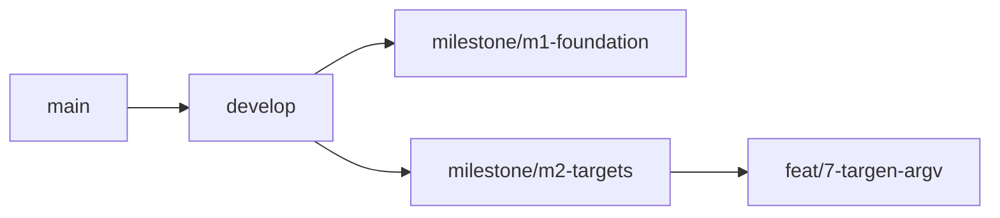

# BUILD-PLAN.md — ICCery v2 Mac

Spec snapshot: `docs/`. Source of tickets: Gitea milestones M1–M6 + Later.

## Sprint rule
Do not start milestone N+1 implementation until milestone N **CI/mock gate** is green.
Hardware gates block *release of that sprint*, not filing, and not starting coding of the next sprint's non-dependent tickets.

## Milestone map

| Id | Name | Issues | CI/mock gate | Hardware gate |
|----|------|--------|--------------|---------------|
| M1 | Foundation & process core | 1–6 | App launches; wizard shell; ProcessManager + `runCaptured`; artefact gating tests; settings persist + dialog | N/A |
| M2 | Target generation & layout | 7–11 | targen → `.ti1`; printtarg → `.ti2`+TIFF; manifest+gallery; resume; presets | N/A |
| M3 | Unmanaged printing (`lp`) | 12–15, 17 | parsers; `build_lp_args` goldens (both `AP_*`); cancel → nil | Preferences shows driver PDE; unmanaged page on Epson or Canon |
| M4 | Measurement | 18–22 | `chartread.mock`; 39+ classifier fixtures; ΔE₀₀; snapshot/average | Detect real instrument; one strip or XY through Done → `.ti3` |
| M5 | Profile / verify / install | 23–27 | colprof → `.icc`; profcheck parse; atomic history; install into temp dir | Full `.ti1`→`.icc`; profile visible in ColorSync Utility |
| M6 | Gamut, Stage 0, CGATS, release | 28–32 | `.gam` fixtures; cal argv; CGATS round-trip; signed sidecars; dmgbuild | Stage 0 on a real printer; gamut of a real profile |
| M7 | Deduplicate & consolidate | 79–86 | Shared runner loop; JSONFileStore; preset↔config maps; Notice/log helper; ProcessManager factory; PrintSession VM; identity + colour-type cleanup | N/A |
| Later | Quartz / TargetPrint | 16 | `ICCeryPrintKit` standalone + seam test | 1:1 on paper vs TIFF |

Issue **16 is not an M3 or M6 exit gate.**

## Branch taxonomy

Quoted node labels are required (v0.8.5 #80).

## Command surface (parity with v0.8.5, native names)

Process: `spawn`, `sendStdin`, `kill`, `killAll`, `resolveBinary`, `runCaptured`.
Files: dedicated picker per purpose; `readTiffPreviewPng`; `parseTi2Header`.
Wizard: `verifyStageArtefacts`, `getProfilePath`, `snapshotTi3`, `promoteTi3`.
Runners: `runTargen`, `runPrinttarg`, `runChartread`, `runAverage`, `runColprof`, `runProfcheck`, `extractGamut`, `detectInstruments`.
Cal: `generateCalibrationTarget`, `computeCalibrationCurves`, `applyCalibration`, `parseCalFile`, library + project state.
Print: `getPrinters`, `getPrinterCapabilities`, `showPrinterProperties`, `printTargetNative`.
Install / quality / settings / CGATS: same semantics as `docs/25-rewrite-notes.md` host command list.
