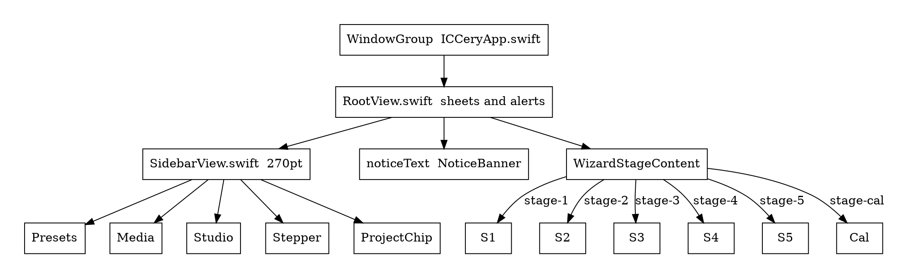
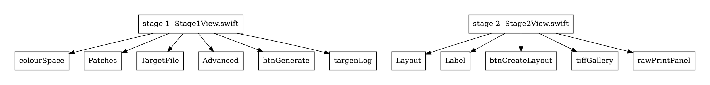
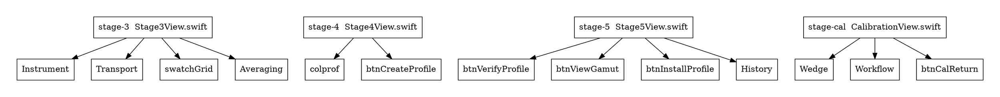
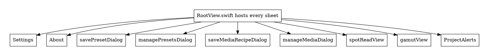

# Interactive UI map

Accessibility **ids**, source files, and enable / hide / disable rules for ICCery v2 (`develop`).

Gitea Kroki 0.30.1 cannot run PlantUML on this host (Graal native image needs AVX2). Overview graphs below are small GraphViz `dot` diagrams with an **opaque white canvas and black type** so they stay readable in dark mode. Detail is in the tables — those are the useful map.

---

## Shell

Window is `ICCeryApp.swift` (1280×800, min 1100×700). Almost every sheet is presented from `RootView.swift`, not the 270 pt sidebar.

`noticeText` (`NoticeBanner.swift`): shown when `wizard.notice != nil`. Auto-hides after 6s unless `autoHideAfter` is nil. Close (xmark) has no accessibility id. Behind a modal sheet it is not in the AX tree — Manage Media uses `manageMediaNotice` instead (#170).

### Sidebar header — `SidebarView.swift`

| Id | Type | Shown | Disabled when |
| --- | --- | --- | --- |
| `openSettingsBtn` | Button (gear) | always | never |
| `openAboutBtn` | Button (info) | always | never |
| `btnToggleAllHelp` | Button | always | never — toggles yellow help dots |

### Presets — `SidebarView.swift` / `PresetDialogs.swift`

| Id | Type | Shown | Disabled when |
| --- | --- | --- | --- |
| `presetSelect` | Picker.menu | always | never. `none` does **not** factory-reset |
| `btnSavePresetModal` | Button | always | never |
| `btnOpenPresetsDialog` | Button | always | never |

### Media library — `SidebarView.swift` / `MediaLibraryDialogs.swift`

| Id | Type | Shown | Disabled when |
| --- | --- | --- | --- |
| `mediaSelect` | Picker.menu | always | never. Failed Apply snaps back to `none` |
| `mediaRecipeStale` | Caption | `staleReasons[selected]` nonempty | — |
| `btnMediaLibraryCapture` | Button | always | `print.selectedPrinter` empty (needs Stage 2 queue) |
| `btnMediaLibraryManage` | Button | always | never |

### Studio (not the stepper)

| Id | Type | Shown | Disabled when |
| --- | --- | --- | --- |
| `btnCalibratePrinter` | Button | always | never. Enters Stage 0 (`stage-cal`) |
| `btnViewGamut` | Button | always | **never on the sidebar**. Same id as Stage 5, where it **is** disabled if there is no `.gam` |
| `btnSpotRead` | Button | always | no working folder **or** Stage 3 `chartread` is running |

### Stepper 1–5 — `SidebarView.swift` / `WizardGating.swift`

Each row is a `Button.plain`. Calibrate is **not** a stepper row.

| Stage | Unlocked when |
| --- | --- |
| 1 Generate (`stage-1`) | always |
| 2 Lay out (`stage-2`) | `.ti1` exists |
| 3 Measure (`stage-3`) | `.ti1` **and** `.ti2` |
| 4 Build (`stage-4`) | `.ti3` (a `.ti2` alone is not enough) |
| 5 Verify (`stage-5`) | `.ti3` **and** `.icc`/`.icm` |

Disabled / opacity 0.45 unless `isUnlocked`. Backward is always allowed. Re-probed when the window becomes key (#151).

### Project chip — `ProjectUI.swift`

| Id | Type | Shown | Disabled when |
| --- | --- | --- | --- |
| `projectChip` | container | always | — |
| `projectChipName` | Text | always (`No project` if unbound) | — |
| `projectChipPath` | Text | bound | — |
| `projectChipStale` | Caption | `diskBehindNotes` | — |
| `btnProjectReveal` | Button | bound | never |
| `btnProjectSave` | Button | bound | `!canSave` (needs bind + basename + cwd). `CAL_` basename stays enabled so the refusal banner can fire |
| `btnProjectOpen` | Button | **not** bound | never |

### File menu — `ProjectCommands` in `ICCeryApp.swift`

Menu ids are `menuProject*`, not `btnProject*`.

| Id | Type | Disabled when |
| --- | --- | --- |
| `menuProjectNew` | Button Cmd-N | never |
| `menuProjectOpen` | Button Cmd-O | never |
| `menuProjectRecents` | Menu | recents empty. Items: `projectRecent-{bookmarkHash}`, `menuProjectRecentsClear` |
| `menuProjectSave` | Button Cmd-S | `!canSave` |
| `menuProjectSaveAs` | Button Shift-Cmd-S | `!canSaveAs` (basename + cwd; bind not required) |
| `menuProjectReport` | Button | `!canReport` |
| `menuProjectClose` | Button | `!isBound` |

---

## Stages 1–2

### Stage 1 — `Stage1View.swift` / `TargetWorkflowViewModel.swift`

| Id | Type | Shown | Disabled when |
| --- | --- | --- | --- |
| `colourSpace` | Picker.segmented | always | never. RGB \| CMYK |
| `patchCountPreset` | Picker | always | never |
| `patchCountCustom` | TextField.number | `patchPreset == .custom` | — |
| `whitePatches` | Stepper 0…50 | always | never |
| `blackPatches` | Stepper 0…50 | always | never |
| `targetBasename` | TextField | always | never |
| `btnBrowse` | Button | always | never |
| `btnSelectWorkDir` | Button | always | never |
| `btnOpenExisting` | Button | always | never. `.ti1` or `.ti2` (+ matching `.ti1`) |
| `btn-import-dataset` | Button | always | never. `.ti3` / txt / cgats / csv; unlocks stage 4 |
| `selectedPathDisplay` | Text | always | — |
| `targenAdvancedDetails` | DisclosureGroup | always | UI tests pre-expand it |
| `targenGreySteps` | Toggle + TextField | inside Advanced | field only if toggle on |
| `targenSingleChannelSteps` | Toggle + TextField | inside Advanced | field only if toggle on |
| `targenNeutralSteps` | Toggle + TextField | inside Advanced | field only if toggle on |
| `targenNeutralConcentration` | Toggle + Slider 0…1 | inside Advanced | slider only if toggle on |
| `targenAdaptation` | Toggle + Slider 0…1 | inside Advanced | slider only if toggle on |
| `targenPrecondProfile` | TextField | inside Advanced | — |
| `btnBrowsePrecondProfile` | Button | inside Advanced | — |
| `targenHighQuality` | Toggle | inside Advanced | — |
| `targenAlgorithm` | Picker | inside Advanced | — |
| `targenInkLimitGroup` | Toggle + TextField | Advanced **and** colour space is CMYK | field only if toggle on |
| `targenDarkEmphasis` | Toggle + Slider 0…3 | inside Advanced | slider only if toggle on |
| `targenDevicePower` | Toggle + Slider 0…3 | inside Advanced | slider only if toggle on |
| `btnGenerate` | Button | always | `!canGenerate` or `targenRunning`. `canGenerate` = valid basename **and** directory |
| `targenLogContainer` / `targenLog` | DisclosureGroup | always | `ProcessLogView.swift` |

Those four sliders are the **only** sliders in the app.

### Stage 2 — `Stage2View.swift` / `PrintSessionViewModel.swift`

| Id | Type | Shown | Disabled when |
| --- | --- | --- | --- |
| `cmWarningBanner` | Banner | always on stage 2 | not a control |
| `instrumentSelect` | Picker | always | never. Chart **code**, not a USB port |
| `pageSizeSelect` | Picker | always | never |
| `customPageSizeRow` (`customPageW` / `customPageH`) | TextField.number | `pageSize == .custom` | — |
| Bit depth picker | Picker | always | no a11y id |
| `tiffDpi` | Stepper 72…600 | always | never |
| `printtargLayoutOrder` | Picker | always | never |
| `printtargCustomSeedGroup` / `printtargCustomSeed` | TextField | `layoutOrder == .customSeed` | — |
| `btnToggleLabelEdit` | Button | always | never. Title swaps Edit / Use automatic |
| `targetMetadataPrinter` | TextField | always | never |
| `targetMetadataInkSet` | TextField | always | never |
| `targetMetadataDriverPaper` | TextField | always | never |
| `targetMetadataActualPaper` | TextField | always | never |
| `targetLabelPreview` | TextField or Text | always | TextField only if `labelIsCustom` |
| `btnCreateLayout` | Button | always | `printtargRunning` or basename empty |
| `printtargLogContainer` | DisclosureGroup | always | — |
| `tiffGallery` | Grid | `printtargResult != nil` | children: `galleryInfo`, `galleryGrid`, `galleryPage-{n}` |
| `btnPrintPage-{n}` | Button | that gallery cell | `isPrinting` or no selected printer |

#### `rawPrintPanel`

| Id | Type | Shown | Disabled when |
| --- | --- | --- | --- |
| `printerSelect` | Picker | always | never |
| `printerStatusBadge` | Caption | selected printer is in the list | — |
| `btnRefreshPrinters` | Button | always | never |
| `btnPrinterProperties` | Button | always | `selectedPrinter` empty |
| `printerTraySelect` | Picker | trays nonempty | — |
| `printerMediaTypeSelect` | Picker | media types nonempty | — |
| `btnOrientPortrait` | Button | always | never |
| `btnOrientLandscape` | Button | always | never |
| `btnPrintAll` | Button | always | printing, or no layout, or no printer |
| `btnAdvanceToStage3` | Button | always | no layout or `!isUnlocked(.measure)` |
| `printNotificationText` | Caption | `printNotice != nil` | — |

---

## Stages 3–5 and Calibrate

### Stage 3 — `Stage3View.swift` / `MeasurementWorkflowViewModel.swift`

Transport buttons **replace each other** from `chartreadState`. Stage 3 ids must not be reused on Spot Read.

| Id | Type | Shown | Disabled when |
| --- | --- | --- | --- |
| `btnDetectInstruments` | Button | always | `isDetecting` |
| `chartreadInstrumentSelect` | Picker.menu | always | never |
| `xyTableHint` | Caption | selected instrument is XY | — |
| `xyTablePanel` | Place/Align/Scan/Remove | is XY | highlight = `xyStep` |
| `chartreadPrompt` | Text | always | — |
| `chartreadLastError` | Caption | `chartreadNotice != nil` | — |
| `btnStartRead` | Button | **not** running | `!canStartRead` (needs basename, cwd, not running) |
| `btnCalibrate` | Button | running **and** calibrating | — |
| `btnTrigger` | Button | running **and** awaitingStrip | — |
| `btnDoneReadEarly` | Button | awaitingStrip | — |
| `btnAccept` | Button | place / align / continue / warning | title may be `Continue (send 'X')` |
| `btnRetry` | Button | state == error | — |
| `btnDoneRead` | Button | allStripsRead | — |
| `btnCancel` | Button | `isChartreadRunning` | — |
| `swatchGrid` | Scroll | always | cells `swatch-{rowId}{loc}` |
| `readStats` | Text | always | — |
| `chartreadAveragingPanel` | Panel | passes nonempty **or** `isFinished` | — |
| `btnMeasureAnotherSheet` | Button | averaging panel | `!isFinished` or still running |
| `btnFinishAndAverage` | Button | averaging panel | `!canFinish` or `isFinishing`. `canFinish` = finished **and** at least one pass |

### Stage 4 — `Stage4View.swift` / `ProfileWorkflowViewModel.swift`

| Id | Type | Shown | Disabled when |
| --- | --- | --- | --- |
| `colprofAlgorithm` | Picker | always | never |
| `colprofQuality` | Picker | always | never |
| `colprofFwa` | Picker | always | never |
| `colprofFwaCustomPath` | TextField | custom spectrum selected | — |
| `btnBrowseFwaSp` | Button | with custom path | — |
| `colprofIlluminant` | TextField | always | never |
| `colprofObserver` | TextField | always | never |
| `colprofInputViewCond` | TextField | always | never |
| `colprofOutputViewCond` | TextField | always | never |
| `colprofDescription` | TextField | always | never |
| `colprofCopyright` | TextField | always | never |
| `colprofApplyCalibration` | Toggle | always | never |
| `colprofCalibrationFile` | TextField | `applyCalibration` | — |
| `btnBrowseCalibrationFile` | Button | `applyCalibration` | — |
| `btnCreateProfile` | Button | always | `!canCreateProfile` (basename, cwd, not running) |
| `colprofProgressIndicator` | Progress | `isColprofRunning` | — |

### Stage 5 — `Stage5View.swift`

| Id | Type | Shown | Disabled when |
| --- | --- | --- | --- |
| `btnVerifyProfile` | Button | always | `!canVerify` (no profile or profcheck running) |
| `profcheckProgressIndicator` | Progress | `isProfcheckRunning` | — |
| `btnViewGamut` | Button | always | `createdGamutURL == nil` — **same id as sidebar** |
| `btnInstallProfile` | Button | always | `createdProfileURL == nil` |
| `driftPrinterFilter` | Picker | always | never |
| `btnExportHistory` | Button | always | never |
| `btnClearHistory` | Button | always | never |
| `verificationHistoryTable` | Table | always | — |
| `driftChart` | View | always | not interactive (`DriftChartView.swift`) |
| `driftAlert` / `profcheckWarningBanner` | Banner | fail / warning status | — |
| `profileOverwriteBtn` | Alert button | install collision **and** ask-before-overwrite | — |
| `profileRenameBtn` | Alert button | same | — |
| `profileCancelCollisionBtn` | Alert button | same | — |

### Stage 0 — `CalibrationView.swift` (`stage-cal`)

| Id | Type | Shown | Disabled when |
| --- | --- | --- | --- |
| Colour space | Picker.segmented | always | no a11y id. RGB \| CMYK |
| `calSteps` | TextField.number | always | never |
| White patches | TextField.number | always | no a11y id |
| `calInkExplore` | TextField | colour space is CMYK | — |
| `calNeutralEmphasis` | Toggle.checkbox | always | never |
| `btnCalGenerate` | Button | always | empty basename, no cwd, or `isGenerating` |
| `btnCalLayout` | Button | always | same as Generate |
| `btnCalMeasure` | Button | always | `calibrationTi3URL == nil` |
| `btnCalCompute` | Button | always | `!canCompute` (no `.ti3` or computing) |
| `calApplyToggle` | Toggle | `computedCalURL != nil` | — |
| `btnCalReturn` | Button Esc | always | never. Restores the original basename |

---

## Sheets

### Settings — `SettingsView.swift` (560×620)

| Control | Type | Notes |
| --- | --- | --- |
| Argyll dir + Browse | TextField | empty ⇒ bundled sidecars |
| Default instrument | Picker | None + i1 / p3 / CM / SS / 20 / 22 / 41 / 51. Seeds Stage 3 and Spot Read. Does **not** change Stage 2 `instrumentSelect` |
| Enable i1Pro 2 LEDs | Toggle | — |
| `settingsDeltaEGood` | TextField | green cutoff |
| `settingsDeltaEWarning` | TextField | amber cutoff. Save refuses unless Warning > Good |
| `settingsCalStaleDays` | TextField | — |
| Install location | Picker | User \| System library |
| Ask before overwriting | Toggle | — |
| Open ColorSync after install | Toggle | — |
| Log level | Picker | — |
| Open log folder / Copy path / Copy excerpt | Buttons | — |
| Cancel / Save | Buttons | Save stays on the sheet if validation fails |

### About — `AboutView.swift`

`aboutDialog`, `aboutVersion`, `aboutBuildDate`, `closeAboutBtn` (Esc).

### Save / manage presets — `PresetDialogs.swift`

| Id | Type | Shown | Disabled when |
| --- | --- | --- | --- |
| `savePresetName` | TextField | save sheet | — |
| `savePresetDesc` | TextField | save sheet | — |
| `btnCloseSavePresetDialog` | Button | save sheet | — |
| `btnConfirmSavePreset` | Button | save sheet | name trimmed empty |
| `presetRow-{id}` | Row | manage list | Built-in: no delete. Else `btnExportPreset-{id}`, `btnDeletePreset-{id}` |
| `btnImportPreset` | Button | manage | — |
| `btnExportActivePreset` | Button | selected preset is custom | — |
| `btnCloseManagePresetsDialog` | Button | manage | — |

### Save / manage media — `MediaLibraryDialogs.swift`

| Id | Type | Shown | Disabled when |
| --- | --- | --- | --- |
| `saveMediaName` / `Notes` / `Paper` / `Ink` | TextField | save sheet | — |
| `saveMediaPrinter` / `Preset` / `ColourSpace` / `Cal` | read-only | save sheet | — |
| `saveMediaApplyCal` | Toggle | save sheet | `!calApplyable` (path missing or `CAL_` stem) |
| `btnCloseSaveMediaDialog` | Button | save sheet | — |
| `btnConfirmSaveMedia` | Button | save sheet | name, paper or ink empty, **or** colour-space mismatch |
| `mediaLibraryList` | List | manage | rows `mediaRow-{id}`; `btnMediaLibraryApply-{id}`; `btnMediaLibraryDelete-{id}`; double-click = Apply |
| `manageMediaNotice` | Caption | `manageApplyNotice != nil` | in-sheet copy of a failed Apply (#170) |
| `btnMediaLibraryApply` | Button | manage | `selection == nil` |
| `btnMediaLibraryCaptureFromManage` | Button | manage | dismiss then open capture |
| `btnCloseManageMediaDialog` | Button | manage | — |
| Delete alert | Alert | pending delete | Cancel / Delete |

Failed Apply **keeps** the manage sheet open. The window banner is occluded — use `manageMediaNotice`.

### Spot Read — `SpotReadView.swift` (`spotReadView`)

Enabled from the sidebar only with a working folder and no live Stage 3 `chartread`. Opening this sheet never kills `chartread_{basename}`. Close / dismiss = Stop.

| Id | Type | Shown | Disabled when |
| --- | --- | --- | --- |
| `spotSidecarMissing` | Text | sidecar missing | hides instrument + transport |
| `btnSpotDetectInstruments` | Button | sidecar present | detecting or running |
| `spotInstrumentSelect` | Picker | sidecar present | `isRunning` |
| `spotDefaultMissing` | Caption | saved default not plugged in | — |
| `spotSetDefault` | Toggle | sidecar present | — |
| `spotXYHint` | Caption | selected is XY | XY tables belong on Stage 3 |
| `btnSpotStart` | Button | not running | `!canStart` (sidecar, cwd, not detecting/running/chartread) |
| `btnSpotCalibrate` | Button | running and calibrating | — |
| `btnSpotTrigger` | Button | running and awaitingStrip | labelled Read |
| `btnSpotStop` | Button | `isRunning` | — |
| `spotLastSample` / `spotLabL/A/B` / `spotXYZ` / `spotDeltaE` | Display | last sample exists | `spotDeltaE` hidden on the first sample. `spotLabImplausible` if L not in 0…100 |
| `spotHistoryTable` | List | samples nonempty | rows `spotHistoryRow-{uuid}` — click restores, does not trigger |
| `btnSpotCopyLab` | Button | always | no displayed sample |
| `btnSpotExportCsv` | Button | always | history empty |
| `btnCloseSpotRead` | Button Esc | always | never |

### Gamut — `GamutView.swift` (`gamutView`)

| Id | Type | Shown | Disabled when |
| --- | --- | --- | --- |
| `gamutLayer-srgb` | Toggle.checkbox | always | never. Can hide, cannot remove |
| `gamutLayer-profile` | Toggle | always | no session `.gam` |
| `gamutLayer-compare` | Toggle | always | no compare layer |
| `btnGamutAddCompare` | Menu | always | `btnGamutOpenGam` / `btnGamutOpenProfile` |
| `btnGamutRemoveCompare` | Button | always | no compare layer |
| `btnGamutSampleTiff` | Button | always | never |
| `gamutViewerUnavailable` | Caption | no Metal | toggles + inspect still work |
| `btnResetGamutCamera` | Button | always | R when focused |
| `gamutLabEntryL/A/B` | TextField | always | — |
| `btnGamutInspectLab` | Button | always | `!canInspectLab` |
| `gamutInspectPanel` | Panel | inspect result | — |
| `btnCloseGamut` | Button Esc | always | never |
| `gamutTiffPreview` | Sheet | `showingTiffPreview` | `btnCloseGamutTiffPreview` |

### Project alerts — `RootView.swift` / `ProjectUI.swift`

| Id | Type | Shown |
| --- | --- | --- |
| `projectNewAlert` | Alert | New Project. `btnProjectNewCancel` / `btnProjectNewConfirm` |
| Dirty save | Alert | New/Open/Close while dirty. `btnProjectDirtySave` / `btnProjectDirtyDiscard` / `btnProjectDirtyCancel` |
| `projectRelocateSheet` | Sheet | Open when `cwd` is missing. `btnProjectRelocateCancel` / `btnProjectRelocate` |

---

## Mutexes

- Spot Read is disabled while Stage 3 `chartread` is running.
- Opening Spot Read does not kill `chartread_{basename}`.
- Calibrate uses a temporary `CAL_` basename; Save Project stays enabled so the refusal banner can fire.
- Failed media Apply keeps `manageMediaDialog` open.
- Duplicate id: `btnViewGamut` (sidebar always on; Stage 5 off without a `.gam`).
