# Interactive UI map

GraphViz diagrams for Gitea Kroki 0.30.1 (PlantUML's Graal image needs AVX2; this host has none).

Colours are set **inside the SVG** (dark fill, light type, opaque background) so Gitea dark mode does not turn nodes into black boxes on a transparent canvas.

Node labels are accessibility identifiers, source files, and enable / hide / disable rules.

## Shell

Window, sidebar, stepper, File menu. Source: [`ui-interactive-map-shell.dot`](ui-interactive-map-shell.dot)

```graphviz
digraph ICCeryUIShell {
  graph [label="ICCery UI — shell, sidebar, stepper, File menu\nids are accessibility identifiers. Gating: WizardGating.swift",
    labelloc=t,
    fontname="Helvetica",
    fontsize=16,
    fontcolor="#e6edf3",
    bgcolor="#0d1117",
    pad="0.4",
    nodesep=0.35,
    ranksep=0.55]
  node [shape=box, style="filled,rounded", fontname="Helvetica", fontsize=12,
        fontcolor="#e6edf3", fillcolor="#21262d", color="#8b949e",
        penwidth=1.2, margin="0.22,0.14"]
  edge [fontname="Helvetica", fontsize=10, color="#8b949e", fontcolor="#8b949e"]

  win [label="WindowGroup ICCery\nICCeryApp.swift\n1280x800, min 1100x700"]
  root [label="RootView.swift\nsheets and alerts live here"]
  win -> root

  subgraph cluster_chrome {
    style="filled,rounded"
    fillcolor="#161b22"
    color="#30363d"
    fontcolor="#79c0ff"
    fontsize=13

    label="Persistent chrome"
    side [label="SidebarView.swift\n270 pt"]
    ban [label="noticeText  NoticeBanner.swift\nshown: wizard.notice != nil\nauto-hide 6s; close has no id"]
    stage [label="WizardStageContent\nswitch wizard.stage"]
  }
  root -> side
  root -> ban
  root -> stage

  subgraph cluster_header {
    style="filled,rounded"
    fillcolor="#161b22"
    color="#30363d"
    fontcolor="#79c0ff"
    fontsize=13

    label="Header"
    sSet [label="openSettingsBtn  Button\nalways on → Settings sheet"]
    sAbt [label="openAboutBtn  Button\nalways on → About"]
    sHlp [label="btnToggleAllHelp  Button\ntoggles showingAllHelp overlays"]
  }
  side -> sSet
  side -> sAbt
  side -> sHlp

  subgraph cluster_preset {
    style="filled,rounded"
    fillcolor="#161b22"
    color="#30363d"
    fontcolor="#79c0ff"
    fontsize=13

    label="Presets (#11)"
    pre [label="presetSelect  Picker.menu\nnone + ProfilingPreset.id\napply on change; none is not factory reset"]
    preS [label="btnSavePresetModal  Button\nalways on"]
    preM [label="btnOpenPresetsDialog  Button\nalways on"]
  }
  side -> pre
  side -> preS
  side -> preM

  subgraph cluster_media {
    style="filled,rounded"
    fillcolor="#161b22"
    color="#30363d"
    fontcolor="#79c0ff"
    fontsize=13

    label="Media library (#146)"
    med [label="mediaSelect  Picker.menu\nnone + MediaRecipe.id\nnever reuses presetSelect"]
    medSt [label="mediaRecipeStale  Caption\nshown: staleReasons nonempty"]
    medC [label="btnMediaLibraryCapture  Button\ndisabled: selectedPrinter empty"]
    medM [label="btnMediaLibraryManage  Button\nalways on"]
  }
  side -> med
  side -> medSt
  side -> medC
  side -> medM

  subgraph cluster_studio {
    style="filled,rounded"
    fillcolor="#161b22"
    color="#30363d"
    fontcolor="#79c0ff"
    fontsize=13

    label="Studio (not stepper)"
    calB [label="btnCalibratePrinter  Button\nalways on; Stage 0"]
    gamB [label="btnViewGamut  Button\nSAME id as Stage 5\nalways on; no .gam = sRGB only"]
    spotB [label="btnSpotRead  Button\ndisabled: no cwd OR chartread running"]
  }
  side -> calB
  side -> gamB
  side -> spotB

  subgraph cluster_step {
    style="filled,rounded"
    fillcolor="#161b22"
    color="#30363d"
    fontcolor="#79c0ff"
    fontsize=13

    label="Stepper 1-5 (disk is truth)"
    step [label="StepperRow  Button.plain\ndisabled/opacity 0.45 unless isUnlocked\nbackward always; calibrate is not a row"]
    nGate [shape=note, style=filled, fillcolor="#3d2f00", fontcolor="#f0e6c8", color="#d4a72c", label="WizardGating.swift\n1 always\n2 .ti1\n3 .ti1 AND .ti2\n4 .ti3 (not .ti2 alone)\n5 .ti3 AND .icc/.icm\nre-probe on window key (#151)"]
  }
  side -> step
  step -> nGate [style=dashed]

  subgraph cluster_chip {
    style="filled,rounded"
    fillcolor="#161b22"
    color="#30363d"
    fontcolor="#79c0ff"
    fontsize=13

    label="projectChip  ProjectUI.swift (#149)"
    cn [label="projectChipName\nbound name or No project"]
    cp [label="projectChipPath\nshown if bound"]
    cs [label="projectChipStale\nshown: diskBehindNotes"]
    cr [label="btnProjectReveal\nshown if bound"]
    csv [label="btnProjectSave\nshown if bound\ndisabled: !canSave\ncanSave: bound + basename + cwd\nCAL_ still enabled (refusal banner)"]
    co [label="btnProjectOpen\nshown if NOT bound"]
  }
  side -> cn
  side -> cp
  side -> cs
  side -> cr
  side -> csv
  side -> co

  subgraph cluster_menu {
    style="filled,rounded"
    fillcolor="#161b22"
    color="#30363d"
    fontcolor="#79c0ff"
    fontsize=13

    label="File menu  ProjectCommands / ICCeryApp.swift"
    mN [label="menuProjectNew  Cmd-N"]
    mO [label="menuProjectOpen  Cmd-O"]
    mR [label="menuProjectRecents  Menu\ndisabled: recents empty\nprojectRecent-{hash}\nmenuProjectRecentsClear"]
    mS [label="menuProjectSave  Cmd-S\ndisabled: !canSave"]
    mSa [label="menuProjectSaveAs  Shift-Cmd-S\ndisabled: !canSaveAs\ncanSaveAs: basename + cwd"]
    mRp [label="menuProjectReport\ndisabled: !canReport"]
    mCl [label="menuProjectClose\ndisabled: !isBound"]
  }

  st1 [label="stage-1  Stage1View.swift"]
  st2 [label="stage-2  Stage2View.swift"]
  st3 [label="stage-3  Stage3View.swift"]
  st4 [label="stage-4  Stage4View.swift"]
  st5 [label="stage-5  Stage5View.swift"]
  st0 [label="stage-cal  CalibrationView.swift"]
  stage -> st1
  stage -> st2
  stage -> st3
  stage -> st4
  stage -> st5
  stage -> st0
}
```

## Stages 1–2

Generate Target, Lay Out and Print. Source: [`ui-interactive-map-stage1-2.dot`](ui-interactive-map-stage1-2.dot)

## Stages 3–5 + Calibrate

Measure, Build, Verify, Stage 0. Source: [`ui-interactive-map-stage3-5-cal.dot`](ui-interactive-map-stage3-5-cal.dot)

```graphviz
digraph ICCeryUIStage345Cal {
  graph [label="ICCery UI — Stage 3 Measure / 4 Build / 5 Verify / Stage 0 Calibrate",
    labelloc=t,
    fontname="Helvetica",
    fontsize=16,
    fontcolor="#e6edf3",
    bgcolor="#0d1117",
    pad="0.4",
    nodesep=0.35,
    ranksep=0.55]
  node [shape=box, style="filled,rounded", fontname="Helvetica", fontsize=12,
        fontcolor="#e6edf3", fillcolor="#21262d", color="#8b949e",
        penwidth=1.2, margin="0.22,0.14"]
  edge [fontname="Helvetica", fontsize=10, color="#8b949e", fontcolor="#8b949e"]

  subgraph cluster_s3 {
    style="filled,rounded"
    fillcolor="#161b22"
    color="#30363d"
    fontcolor="#79c0ff"
    fontsize=13

    label="stage-3  Stage3View.swift / MeasurementWorkflowViewModel"
    d3 [label="btnDetectInstruments  Button\ndisabled: isDetecting"]
    i3 [label="chartreadInstrumentSelect  Picker.menu\nAuto + instlist ports"]
    xyh [label="xyTableHint  Caption\nshown: selected is XY"]
    xyp [label="xyTablePanel  shown: isXY\nxyStepPlace Align Scan Remove"]
    pr [label="chartreadPrompt  Text"]
    err [label="chartreadLastError  Caption\nshown: chartreadNotice != nil"]
    sr [label="btnStartRead  Button\nshown: !running\ndisabled: !canStartRead\ncanStart: basename AND cwd AND !running"]
    cal3 [label="btnCalibrate  Button\nshown: running AND calibrating"]
    trg [label="btnTrigger  Button\nshown: running AND awaitingStrip"]
    de [label="btnDoneReadEarly  Button\nshown: awaitingStrip"]
    acc [label="btnAccept  Button\nshown: place | align | continue | warning"]
    rty [label="btnRetry  Button\nshown: state == error"]
    dn [label="btnDoneRead  Button\nshown: allStripsRead"]
    cnc [label="btnCancel  Button\nshown: isChartreadRunning"]
    sw [label="swatchGrid  swatch-{rowId}{loc}"]
    rst [label="readStats  Text"]
    avg [label="chartreadAveragingPanel\nshown: passes nonempty OR isFinished"]
    mas [label="btnMeasureAnotherSheet  Button\ndisabled: !isFinished OR running"]
    fa [label="btnFinishAndAverage  Button\ndisabled: !canFinish OR isFinishing\ncanFinish: isFinished AND passes nonempty"]
  }

  subgraph cluster_s4 {
    style="filled,rounded"
    fillcolor="#161b22"
    color="#30363d"
    fontcolor="#79c0ff"
    fontsize=13

    label="stage-4  Stage4View.swift / ProfileWorkflowViewModel"
    alg [label="colprofAlgorithm  Picker"]
    q [label="colprofQuality  Picker"]
    fwa [label="colprofFwa  Picker"]
    fwap [label="colprofFwaCustomPath  TextField\nshown: custom spectrum"]
    fwab [label="btnBrowseFwaSp  Button\nshown with custom path"]
    ill [label="colprofIlluminant  TextField"]
    obs [label="colprofObserver  TextField"]
    ivc [label="colprofInputViewCond  TextField"]
    ovc [label="colprofOutputViewCond  TextField"]
    desc [label="colprofDescription  TextField"]
    cpr [label="colprofCopyright  TextField"]
    ac [label="colprofApplyCalibration  Toggle"]
    cf [label="colprofCalibrationFile  TextField\nshown: applyCalibration"]
    cfb [label="btnBrowseCalibrationFile  Button\nshown: applyCalibration"]
    cp [label="btnCreateProfile  Button\ndisabled: !canCreateProfile\ncanCreate: basename AND cwd AND !colprofRunning"]
    cpi [label="colprofProgressIndicator\nshown: isColprofRunning"]
  }

  subgraph cluster_s5 {
    style="filled,rounded"
    fillcolor="#161b22"
    color="#30363d"
    fontcolor="#79c0ff"
    fontsize=13

    label="stage-5  Stage5View.swift"
    vf [label="btnVerifyProfile  Button\ndisabled: !canVerify\ncanVerify: createdProfileURL AND !profcheckRunning"]
    ppi [label="profcheckProgressIndicator\nshown: isProfcheckRunning"]
    vg5 [label="btnViewGamut  Button\nDUPLICATE id with sidebar\ndisabled: createdGamutURL == nil"]
    inst [label="btnInstallProfile  Button\ndisabled: createdProfileURL == nil"]
    df [label="driftPrinterFilter  Picker"]
    eh [label="btnExportHistory  Button"]
    ch [label="btnClearHistory  Button"]
    ht [label="verificationHistoryTable"]
    dc [label="driftChart  DriftChartView.swift\nnot interactive"]
    dalt [label="driftAlert / profcheckWarningBanner\nshown on fail / warning"]
  }

  subgraph cluster_coll {
    style="filled,rounded"
    fillcolor="#161b22"
    color="#30363d"
    fontcolor="#79c0ff"
    fontsize=13

    label="Install collision alert"
    io [label="profileOverwriteBtn"]
    ir [label="profileRenameBtn"]
    ic [label="profileCancelCollisionBtn\nshown: showingInstallCollision\nAND askBeforeOverwriteProfile"]
  }

  subgraph cluster_cal {
    style="filled,rounded"
    fillcolor="#161b22"
    color="#30363d"
    fontcolor="#79c0ff"
    fontsize=13

    label="stage-cal  CalibrationView.swift (Stage 0)"
    ccs [label="Colour Space  Picker.segmented\nRGB | CMYK  (no a11y id)"]
    cst [label="calSteps  TextField.number"]
    cwp [label="White patches  TextField.number\n(no a11y id)"]
    cin [label="calInkExplore  TextField\nshown: colourSpace == cmyk"]
    cne [label="calNeutralEmphasis  Toggle.checkbox"]
    cg [label="btnCalGenerate  Button\ndisabled: empty basename OR no cwd OR isGenerating"]
    cl [label="btnCalLayout  Button\nsame disable as Generate"]
    cm [label="btnCalMeasure  Button\ndisabled: calibrationTi3URL == nil"]
    cc [label="btnCalCompute  Button\ndisabled: !canCompute\ncanCompute: .ti3 exists AND !isComputing"]
    cat [label="calApplyToggle  Toggle\nshown: computedCalURL != nil"]
    cr [label="btnCalReturn  Button  Esc\nrestores original basename"]
  }
}
```

## Sheets

Settings, Spot Read, Gamut, media, project alerts. Source: [`ui-interactive-map-sheets.dot`](ui-interactive-map-sheets.dot)

